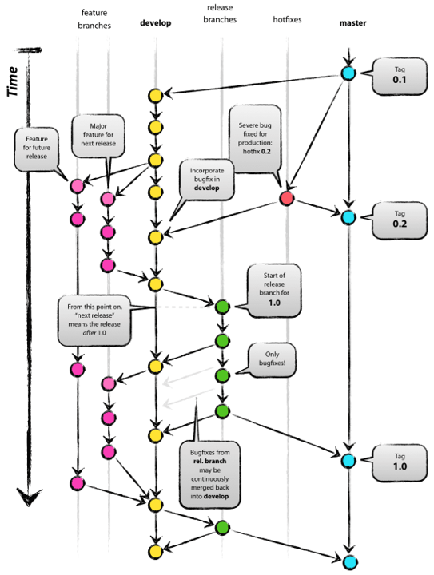

# gitブランチルール

GitFlowを真似したブランチ管理を行う。

## masterブランチ
* リリース専用ブランチ、製品版
* 開発中のコードは入れない
* 実機環境でテストする？

## developブランチ
* チームの開発用ブランチ
* 各個人が開発した機能は、ここにマージする。
  * マージ後、各個人が開発した機能の機能テストを行う
* 全ての機能がマージされてシステムテストが完了したら、masterへマージする。

## featureブランチ
* 個人の開発用ブランチ
* developからブランチを切って作業を開始する。
* 開発して、単体テストが完了したら、developへマージする。

### featureブランチの命名規則
* 作業者名+新機能名、作業者名+作業名、作業者名+issue番号にする。
* ケバブケースで付ける。
  * 例：ninomiya-login
  * 例: ninomiya-bugfix-login-error
  * 例: ninomiya-issue123

## hotfixesブランチ
* リリース後に発覚した緊急性の高いバグに対応するためのブランチ
* masterに直接マージする。
* 緊急性のが低ければ、hotfixesは使わず、通常開発と同様の開発を行う。

### hotfixesブランチの命名規則
* hotfixes+issue番号にする。
* ケバブケースで付ける。
  * 例: hotfixes-issue123

## タグをつけるタイミング
### developブランチ
* システムテストを行うタイミング
* その日の日付でタグをつける
### masterブランチ
* リリースを行うタイミング
* ver.1.0.0でタグをつける
  * 一桁目：メジャーリリース
    * 利用フレームワーク変更など後方互換性がない場合や大規模な変更があった場合、1上げる。二桁目、三桁目を0に戻す
  * 二桁目：マイナーリリース
    * 機能追加、バグ修正のリリース時に1上げる。このとき、三桁目は0に戻す。
  * 三桁目：バグフィックス
    * バグ修正のみのリリースの時、1上げる。