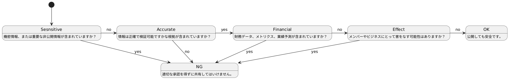

# 非公開情報とは

公開することでグループに不利益が生じる場合、**非公開情報**として非公開とするドキュメントがある。

## ドキュメントの公開範囲

SAFEフレームワークに則って、非公開情報かどうかが決定される。
SAFEとは下記の頭文字を取ったものである。

* Sensitive(センシティブ)
* Accurate(正確な情報)
* Financial(財務情報)
* Effect(影響)

### Sensitive
一般に公開していない情報が対象となる。
* グループ内のメンバー限定のハンドブック
* チームメンバーの業務パフォーマンス、在籍期間
* 顧客とパートナーの情報

### Accurate
公開しようとしている情報に検証可能な根拠が含まれていない場合、対象となる。
* 曖昧な情報
* 誤った情報

### Financial
財務情報をCFOに無断で公開することは禁止する。
* 業績
* 公開していないメトリクス
* 業績見通し、予測

### Effect
自分が発信する情報によってメンバーがグループにどのような影響を及ぼすのかを検討する必要がある。
公開することで、顧客やメンバーに悪影響がないか、立ち止まって検証する。
このような場合、自分だけで判断せず、必ず誰かに相談すること。

### SAFEフレームワークのフロー図
