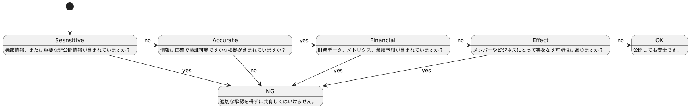

# 非公開情報とは

非公開情報とは、公開することでグループや関係者に不利益やリスクが生じる可能性があるため、開示を制限すべき情報を指します。本ドキュメントにおいては、こうした情報を含む文書を「非公開情報ドキュメント」として取り扱い、その公開範囲を慎重に管理します。

## ドキュメントの公開範囲

ドキュメントの公開範囲は、以下のSAFEフレームワークに則って決定します。SAFEは、それぞれの要素の頭文字を取ったもので、情報の公開可否を判断する基準となります。

* Sensitive(センシティブ)
* Accurate(正確な情報)
* Financial(財務情報)
* Effect(影響)

### Sensitive
一般に公開していない情報が該当する。
社外や特定の第三者に知られることで、不利益が生じる可能性があるものを指す。

* グループ内メンバーのみが閲覧できるハンドブック
* チームメンバーの業務パフォーマンスや在籍期間
* 顧客やパートナーに関する詳細情報

### Accurate
公開しようとする情報に、検証可能な根拠が含まれていない場合が該当する。
曖昧・誤情報を公開すると混乱を招く恐れがあるため、正確性が担保できない情報は非公開に分類される場合がある。

* 曖昧な噂や未確認の情報
* 内容が誤っている恐れのあるデータやレポート

### Financial
グループの財務データや業績見通しなど、経営に関わる数値情報が該当する。
CFO（最高財務責任者）などの承認なしに公開することは原則禁止する

* 未公表の業績指標
* 予算や売上見通しなどの将来予測
* 外部には非公開とされている財務レポート

### Effect
公開することで、顧客やメンバー、さらにはグループ全体に悪影響を及ぼす可能性がある情報が該当する。
情報を発信する際は、その内容がどのような影響を与えるかを慎重に検討し、リスクが大きい場合は独断せず必ず上長や関連部門へ相談する。

### SAFEフレームワークのフロー図
